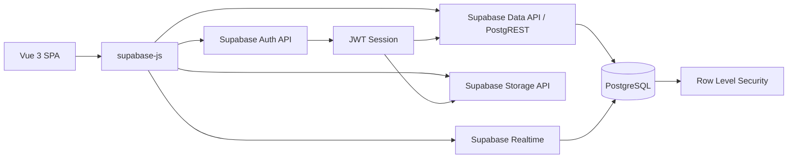
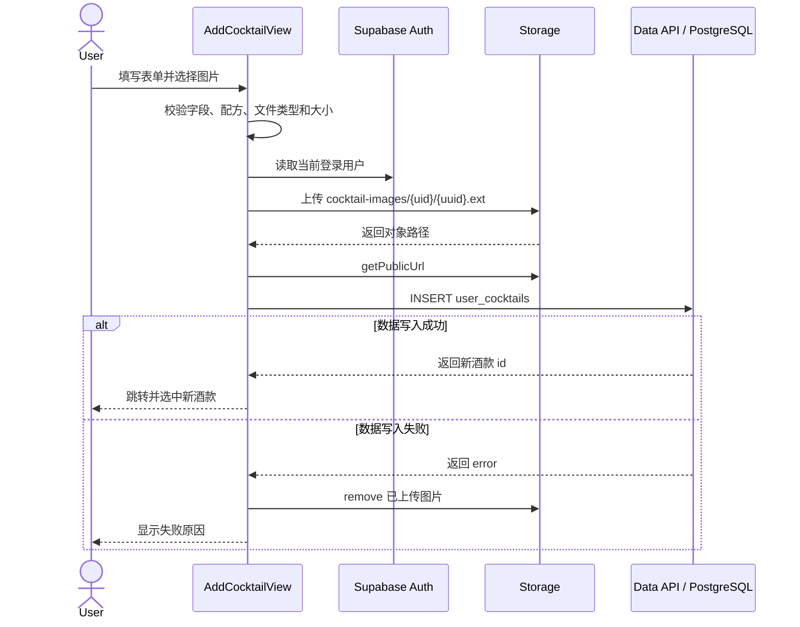
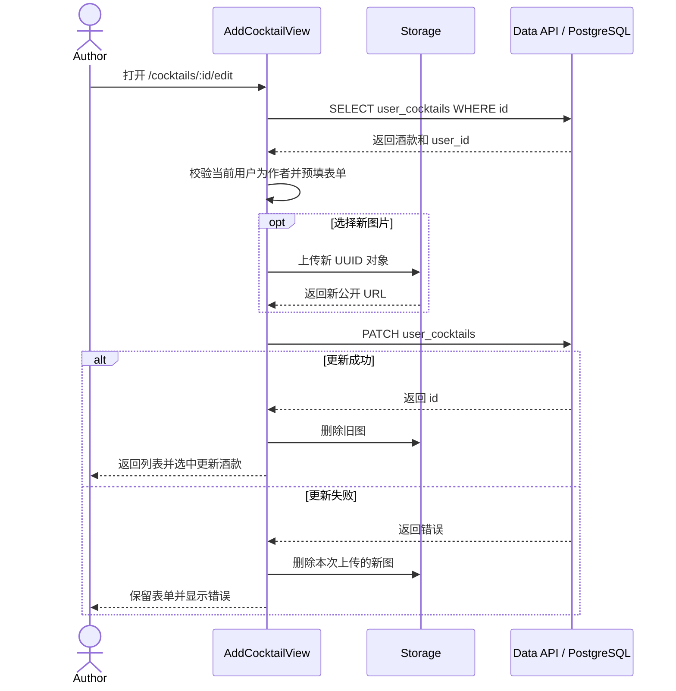
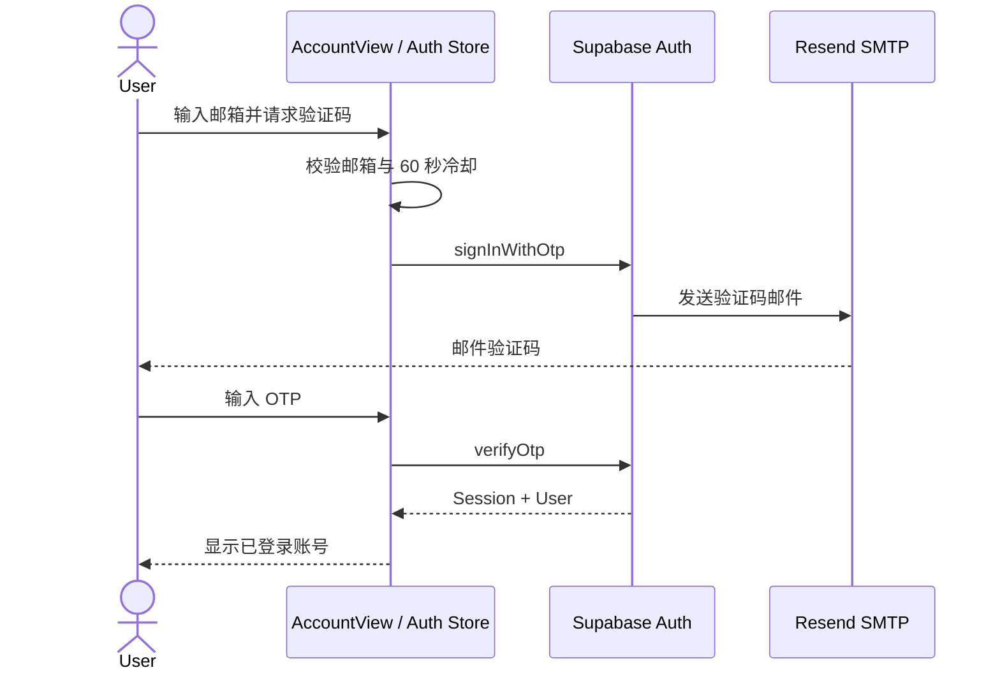

# Luceria Cocktail Atelier API 设计文档

## 1. 文档信息

- 项目：Luceria Cocktail Atelier
- 版本：`1.0.0`
- 前端：Vue 3 + Vite + Pinia
- 后端平台：Supabase
- 数据库：Supabase PostgreSQL
- API 形式：Supabase Data API（PostgREST）、Auth API、Storage API、Realtime
- JavaScript 客户端：`@supabase/supabase-js`
- 文档依据：当前 `src/` 客户端调用和 `supabase/` SQL 脚本

本文档描述项目当前实际使用的 API、数据权限、请求参数、响应结构和错误处理。项目不维护独立的 Node/Express 服务端，Vue SPA 通过 `supabase-js` 调用 Supabase 自动生成的 REST API，并由 PostgreSQL RLS 执行最终授权。

## 2. API 架构



### 2.1 服务边界

| 服务 | 基础地址 | 用途 |
| --- | --- | --- |
| Data API | `{SUPABASE_URL}/rest/v1/{table}` | 查询、新增、更新、删除公开 schema 中的数据 |
| Auth API | `{SUPABASE_URL}/auth/v1/*` | 邮箱登录、OTP 验证、会话和用户资料 |
| Storage API | `{SUPABASE_URL}/storage/v1/*` | 头像和酒款图片上传、删除、公开 URL |
| Realtime | Supabase Realtime WebSocket | 牌局房间、成员和消息变化订阅 |

前端主要使用 SDK 方法，不直接拼接 HTTP 地址。`.from("table").select()`、`.insert()`、`.update()` 和 `.delete()` 会映射为 PostgREST 的 `GET`、`POST`、`PATCH` 和 `DELETE`。

### 2.2 客户端配置

入口：`src/lib/supabase.js`

```js
{
  auth: {
    autoRefreshToken: true,
    persistSession: true,
    detectSessionInUrl: true,
    flowType: "pkce"
  }
}
```

环境变量：

```txt
VITE_SUPABASE_URL
VITE_SUPABASE_ANON_KEY
```

浏览器只能使用 Supabase Publishable Key 或兼容的 Anon Key。禁止在客户端使用 `service_role` 或 Secret Key。

### 2.3 通用请求头

SDK 自动处理以下信息：

```http
apikey: <publishable-or-anon-key>
Authorization: Bearer <user-access-token>
Content-Type: application/json
```

未登录请求使用 `anon` 数据库角色；登录后 JWT 会使请求切换为 `authenticated` 角色。

### 2.4 通用响应

`supabase-js` 数据请求统一返回：

```js
{
  data: object | object[] | null,
  error: {
    message: string,
    code?: string,
    details?: string,
    hint?: string
  } | null
}
```

Auth 和 Storage 请求也采用 `{ data, error }` 形式。调用方必须先检查 `error`，再使用 `data`。

## 3. 身份、角色与权限

### 3.1 角色

| 角色 | 识别方式 | 主要权限 |
| --- | --- | --- |
| `anon` | 无用户 JWT | 浏览公开酒款、评论、论坛和公开房间 |
| `authenticated` | `auth.uid()` 有效 | 发布自己的内容、点赞、收藏、上传文件、删除自己的内容 |
| `admin` | `auth.jwt()->'app_metadata'->>'role' = 'admin'` | 删除其他用户发布的评论、帖子、回复和自定义酒款 |

管理员身份存放在 `app_metadata`，不使用可由用户自行修改的 `user_metadata` 做权限判断。

### 3.2 最终授权原则

1. 前端隐藏无权限按钮只用于改善体验。
2. 数据库 RLS 和 Storage Policy 是最终安全边界。
3. 写入时必须使用当前登录用户的 `auth.uid()`。
4. 管理员权限通过 JWT `app_metadata.role` 判断。
5. 管理员角色发生变化后，需要刷新 Access Token 才能获得最新 JWT Claim。

## 4. API 资源总览

| 模块 | 资源 | 读取 | 新增 | 更新 | 删除 |
| --- | --- | --- | --- | --- | --- |
| 登录账号 | Supabase Auth User | 当前用户 | 邮箱登录可创建用户 | 昵称、头像 | 前端未提供注销账号 |
| 评论 | `reviews` | 公开 | 登录用户 | 未实现 | 作者、管理员 |
| 评论点赞 | `review_likes` | 公开 | 登录用户 | 不适用 | 点赞者 |
| 用户酒款 | `user_cocktails` | 公开 | 登录用户 | 作者 | 作者、管理员 |
| 论坛帖子 | `stories_posts` | 公开 | 登录用户 | 未实现 | 作者、管理员 |
| 论坛回复 | `stories_replies` | 公开 | 登录用户 | 未实现 | 作者、管理员 |
| 帖子点赞 | `stories_post_likes` | 公开 | 登录用户 | 不适用 | 点赞者 |
| 帖子收藏 | `stories_post_favorites` | 按当前用户展示 | 登录用户 | 不适用 | 收藏者 |
| 回复点赞 | `stories_reply_likes` | 公开 | 登录用户 | 不适用 | 点赞者 |
| 牌局房间 | `games_rooms` | 公开 | 登录用户 | 房主或房间成员 | 房主 |
| 房间成员 | `games_room_members` | 公开 | 登录用户 | 本人 | 本人 |
| 房间消息 | `games_room_messages` | 公开 | 登录用户 | 未实现 | 未实现 |

`GamesView.vue` 当前没有公开路由，牌局 API 属于已实现但未对用户开放的实验模块；当前 `/games` 页面为本地骰子和转盘，不调用 Supabase。

## 5. Auth API

实现位置：`src/stores/auth.js`

### 5.1 恢复会话

```js
supabase.auth.getSession()
```

用途：应用启动时恢复浏览器中持久化的登录状态。

### 5.2 刷新会话

```js
supabase.auth.refreshSession()
```

用途：

- 刷新 Access Token。
- 读取更新后的管理员 Claim。
- 处理 Token 过期。

### 5.3 发送登录邮件

```js
supabase.auth.signInWithOtp({
  email,
  options: {
    emailRedirectTo: `${window.location.origin}/account`,
    shouldCreateUser: true
  }
})
```

请求约束：

| 字段 | 类型 | 规则 |
| --- | --- | --- |
| `email` | string | 去除首尾空格、转小写、最大 254 字符、必须符合邮箱格式 |
| `emailRedirectTo` | URL | 返回项目 `/account` 页面 |
| `shouldCreateUser` | boolean | 当前为 `true`，不存在的邮箱可自动注册 |

客户端使用 `localStorage` 实现 60 秒发送冷却；Supabase/SMTP 的服务端频率限制仍然有效。

### 5.4 验证邮箱 OTP

```js
supabase.auth.verifyOtp({
  email,
  token,
  type: "email"
})
```

| 字段 | 类型 | 说明 |
| --- | --- | --- |
| `email` | string | 接收验证码的邮箱 |
| `token` | string | 邮件中的一次性验证码 |
| `type` | string | 固定为 `email` |

成功后返回 Session 和 User，客户端进入已登录状态。

### 5.5 交换 PKCE Code

```js
supabase.auth.exchangeCodeForSession(code)
```

用于处理 `/account?code=...` 回调。授权码只能使用一次。

### 5.6 更新用户资料

```js
supabase.auth.updateUser({
  data: {
    display_name,
    avatar_url,
    profile_updated_at
  }
})
```

| 字段 | 类型 | 限制 |
| --- | --- | --- |
| `display_name` | string | 最大 24 字符 |
| `avatar_url` | string | 最大 500 字符 |
| `profile_updated_at` | ISO 8601 string | 客户端用于计算 7 天资料修改冷却 |

资料修改冷却目前由客户端执行，不属于不可绕过的服务端规则。

### 5.7 退出登录

```js
supabase.auth.signOut()
```

成功后清空本地 Session 和 Pinia 用户状态。

### 5.8 监听身份变化

```js
supabase.auth.onAuthStateChange((_event, session) => {
  // 同步当前用户状态
})
```

用于响应登录、登出和 Token 刷新。

## 6. 用户酒款 API

表：`public.user_cocktails`

调用位置：

- 查询：`src/views/CocktailsView.vue`
- 新增、更新：`src/views/AddCocktailView.vue`
- 删除：`src/components/CocktailDetail.vue`
- 共享校验、权限和 Storage：`src/lib/user-cocktails.js`

### 6.1 查询全部用户酒款

SDK：

```js
supabase
  .from("user_cocktails")
  .select("id,name,zh_name,category,base,image,naming,story,profile,method,ingredients,user_id,user_name,created_at,updated_at")
  .order("created_at", { ascending: false })
```

等价 REST 形式：

```http
GET /rest/v1/user_cocktails
  ?select=id,name,zh_name,category,base,image,naming,story,profile,method,ingredients,user_id,user_name,created_at,updated_at
  &order=created_at.desc
```

权限：公开读取。

成功响应示例：

```json
[
  {
    "id": "uuid",
    "name": "Example Cocktail",
    "zh_name": "示例调酒",
    "category": "signature",
    "base": "gin",
    "image": "https://project.supabase.co/storage/v1/object/public/cocktail-images/...",
    "naming": "命名来源",
    "story": "酒款故事",
    "profile": "风味描述",
    "method": "Shake",
    "ingredients": ["45ml Gin", "20ml Lemon Juice"],
    "user_id": "uuid",
    "user_name": "Member",
    "created_at": "2026-07-11T12:00:00Z",
    "updated_at": "2026-07-11T12:00:00Z"
  }
]
```

### 6.2 新增用户酒款

SDK：

```js
supabase
  .from("user_cocktails")
  .insert({
    name,
    zh_name,
    category,
    base,
    image,
    naming,
    story,
    profile,
    method,
    ingredients,
    user_id,
    user_name
  })
  .select("id")
  .single()
```

等价 REST 形式：

```http
POST /rest/v1/user_cocktails?select=id
Prefer: return=representation
```

权限：登录用户只能写入 `user_id = auth.uid()` 的记录。

字段约束：

| 字段 | 规则 |
| --- | --- |
| `name` | 2–60 字符；忽略大小写后唯一 |
| `zh_name` | 1–40 字符 |
| `category` | `classic`、`signature`、`nonalcoholic` |
| `base` | `whiskey`、`tequila`、`gin`、`rum`、`vodka`、`none` |
| `image` | 最大 500 字符 |
| `naming` | 10–300 字符 |
| `story` | 20–800 字符 |
| `profile` | 5–200 字符 |
| `method` | 2–80 字符 |
| `ingredients` | 2–12 项，每项前端限制 2–120 字符 |

成功响应：

```json
{
  "id": "new-cocktail-uuid"
}
```

特殊错误：

| 错误码 | 含义 | UI 处理 |
| --- | --- | --- |
| `23505` | 酒款英文名重复 | 显示“该英文酒名已经存在” |

### 6.3 更新与删除

更新：

```js
supabase
  .from("user_cocktails")
  .update({
    name,
    zh_name,
    category,
    base,
    image,
    naming,
    story,
    profile,
    method,
    ingredients
  })
  .eq("id", cocktailId)
  .eq("user_id", auth.user.id)
  .select("id")
  .single()
```

等价 REST：

```http
PATCH /rest/v1/user_cocktails?id=eq.<cocktail-id>&user_id=eq.<current-user-id>&select=id
Prefer: return=representation
```

更新规则：

- 只有作者可以更新；管理员不能修改其他用户内容。
- 英文名称在 UI 中保持只读，避免按 `cocktail_name` 关联的历史评论失联。
- `updated_at` 由数据库 Trigger 自动更新。
- 未选择新图时保留原 URL。
- 更换图片时先上传新对象；数据库失败则删除新对象，成功后删除旧对象。
- 名称唯一冲突继续返回 PostgreSQL `23505`。

删除：

```js
let query = supabase
  .from("user_cocktails")
  .delete()
  .eq("id", cocktail.id)

if (!auth.isAdmin) {
  query = query.eq("user_id", auth.user.id)
}
```

等价 REST：

```http
DELETE /rest/v1/user_cocktails?id=eq.<cocktail-id>
```

删除规则：

- 作者可以删除自己的记录。
- 管理员可以删除任意用户投稿。
- 数据库记录删除成功后，客户端调用 Storage `remove()` 清理关联图片。
- 图片清理失败不会回滚数据库删除，界面会提示检查孤立对象。

前端入口位于酒款详情中的作者/管理员管理区域。静态内置酒款不属于 `user_cocktails`，不提供更新或删除。

## 7. 评论 API

### 7.1 查询酒款评论

```js
supabase
  .from("reviews")
  .select("id,cocktail_name,cocktail_zh_name,rating,comment,user_id,user_email,user_name,user_avatar,created_at")
  .eq("cocktail_name", cocktail.name)
  .order("created_at", { ascending: false })
```

等价 REST：

```http
GET /rest/v1/reviews
  ?select=id,cocktail_name,cocktail_zh_name,rating,comment,user_id,user_email,user_name,user_avatar,created_at
  &cocktail_name=eq.<cocktail-name>
  &order=created_at.desc
```

权限：公开读取。

### 7.2 新增评论

```js
supabase.from("reviews").insert({
  cocktail_name,
  cocktail_zh_name,
  rating,
  comment,
  user_id,
  user_email,
  user_name,
  user_avatar
})
```

约束：

- 必须登录。
- `user_id` 必须等于 `auth.uid()`。
- `rating` 为 `0–10`。
- `comment` 为 `1–500` 字符。

### 7.3 删除评论

```js
let query = supabase.from("reviews").delete().eq("id", reviewId)

if (!auth.isAdmin) {
  query = query.eq("user_id", auth.user.id)
}
```

权限：

- 普通用户只能删除自己的评论。
- 管理员可删除任意评论。

### 7.4 查询点赞

```js
supabase
  .from("review_likes")
  .select("review_id,user_id")
  .in("review_id", reviewIds)
```

### 7.5 点赞与取消点赞

点赞：

```js
supabase.from("review_likes").insert({
  review_id,
  user_id
})
```

取消：

```js
supabase
  .from("review_likes")
  .delete()
  .eq("review_id", reviewId)
  .eq("user_id", auth.user.id)
```

`review_id + user_id` 具有唯一约束，防止重复点赞。

## 8. 论坛 API

调用位置：`src/views/StoriesView.vue`

### 8.1 论坛数据模型

| 表 | 用途 |
| --- | --- |
| `stories_posts` | 主题帖子 |
| `stories_replies` | 回复与楼中楼 |
| `stories_post_likes` | 帖子点赞 |
| `stories_post_favorites` | 帖子收藏 |
| `stories_reply_likes` | 回复点赞 |

### 8.2 查询帖子

```js
supabase
  .from("stories_posts")
  .select("id,title,body,category,user_id,user_email,user_name,user_avatar,created_at")
  .order("created_at", { ascending: false })
```

权限：公开读取。

排序、类别、只看自己和只看收藏目前在浏览器内存中完成，而不是由 Data API 分页查询。

### 8.3 新增帖子

```js
supabase.from("stories_posts").insert({
  title,
  body,
  category,
  user_id,
  user_email,
  user_name,
  user_avatar
})
```

| 字段 | 限制 |
| --- | --- |
| `title` | 1–60 字符 |
| `body` | 1–500 字符 |
| `category` | `bar`、`recipe`、`city`、`memory` |
| `user_id` | 必须等于 `auth.uid()` |

### 8.4 删除帖子

```js
let query = supabase.from("stories_posts").delete().eq("id", post.id)

if (!auth.isAdmin) {
  query = query.eq("user_id", auth.user.id)
}
```

作者和管理员可以删除。删除帖子会通过外键级联删除对应回复、点赞和收藏。

论坛删除策略由 `supabase/admin-moderation-setup.sql` 提供，未执行该脚本时删除操作会被 RLS 拒绝。

### 8.5 查询回复

```js
supabase
  .from("stories_replies")
  .select("id,post_id,parent_reply_id,user_id,user_email,user_name,user_avatar,body,created_at")
  .in("post_id", postIds)
```

### 8.6 新增回复

```js
supabase.from("stories_replies").insert({
  post_id,
  parent_reply_id,
  user_id,
  user_email,
  user_name,
  user_avatar,
  body
})
```

| 字段 | 说明 |
| --- | --- |
| `post_id` | 所属帖子 UUID |
| `parent_reply_id` | 顶级回复为 `null`，楼中楼为父回复 UUID |
| `body` | 1–280 字符 |
| `user_id` | 必须等于 `auth.uid()` |

### 8.7 删除回复

```js
let query = supabase.from("stories_replies").delete().eq("id", reply.id)

if (!auth.isAdmin) {
  query = query.eq("user_id", auth.user.id)
}
```

作者和管理员可以删除。

### 8.8 帖子点赞

查询：

```js
supabase
  .from("stories_post_likes")
  .select("post_id,user_id")
  .in("post_id", postIds)
```

点赞：

```js
supabase.from("stories_post_likes").insert({
  post_id,
  user_id
})
```

取消：

```js
supabase
  .from("stories_post_likes")
  .delete()
  .eq("post_id", postId)
  .eq("user_id", userId)
```

### 8.9 帖子收藏

`stories_post_favorites` 使用与帖子点赞相同的查询、插入和删除模式：

```js
supabase.from("stories_post_favorites").insert({
  post_id,
  user_id
})
```

### 8.10 回复点赞

`stories_reply_likes` 使用 `reply_id + user_id` 作为唯一关系：

```js
supabase.from("stories_reply_likes").insert({
  reply_id,
  user_id
})
```

## 9. Storage API

### 9.1 头像 Bucket

Bucket：`avatars`

| 属性 | 配置 |
| --- | --- |
| 公开读取 | 是 |
| 最大文件 | 3MB |
| MIME | PNG、JPEG、WEBP、GIF |
| 对象路径 | `{user_id}/avatar.{ext}` |
| 覆盖上传 | `upsert: true` |

上传：

```js
supabase.storage.from("avatars").upload(path, file, {
  upsert: true,
  cacheControl: "3600",
  contentType: file.type
})
```

获取公开 URL：

```js
supabase.storage.from("avatars").getPublicUrl(path)
```

Storage Policy：

- 所有人可读取公开对象。
- 登录用户只能新增、更新或删除自己的对象。

### 9.2 酒款图片 Bucket

Bucket：`cocktail-images`

| 属性 | 配置 |
| --- | --- |
| 公开读取 | 是 |
| 最大文件 | 5MB |
| MIME | JPEG、PNG |
| 对象路径 | `{user_id}/{uuid}.{jpg|png}` |
| 覆盖上传 | `upsert: false` |
| 缓存时间 | `31536000` 秒 |

上传：

```js
supabase.storage.from("cocktail-images").upload(path, file, {
  cacheControl: "31536000",
  contentType,
  upsert: false
})
```

数据库写入失败时回滚图片：

```js
supabase.storage.from("cocktail-images").remove([imagePath])
```

权限：

- 登录用户只能上传到 `{auth.uid()}/...` 目录，策略同时校验对象 `owner`。
- 对象所有者或管理员可以删除。
- Bucket 为公开读取，公开 URL 不需要额外 SELECT Policy；不开放对象列表查询。

图片替换：

1. 上传新 UUID 路径。
2. 更新 `user_cocktails.image`。
3. 更新失败时删除新对象。
4. 更新成功后删除旧对象。

酒款删除时先删除数据库记录，再尽力删除 Storage 对象，避免数据库删除被 RLS 拒绝后留下失效图片引用。

## 10. Realtime API

实现位置：`src/views/GamesView.vue`

该模块当前没有公开路由，但数据库和客户端订阅逻辑已实现。

### 10.1 大厅频道

频道：`games-lobby`

| 事件 | 表 | 过滤器 | 处理 |
| --- | --- | --- | --- |
| `postgres_changes: *` | `games_rooms` | 无 | 重新加载房间列表 |
| `postgres_changes: *` | `games_room_members` | 无 | 重新统计房间人数 |

### 10.2 房间频道

频道：`games-room-{roomId}`

| 事件 | 表 | 过滤器 |
| --- | --- | --- |
| `postgres_changes: *` | `games_rooms` | `id=eq.{roomId}` |
| `postgres_changes: *` | `games_room_members` | `room_id=eq.{roomId}` |
| `postgres_changes: *` | `games_room_messages` | `room_id=eq.{roomId}` |

订阅示意：

```js
supabase
  .channel(`games-room-${roomId}`)
  .on("postgres_changes", {
    event: "*",
    schema: "public",
    table: "games_rooms",
    filter: `id=eq.${roomId}`
  }, loadCurrentRoom)
  .subscribe()
```

离开房间或组件卸载时必须执行：

```js
supabase.removeChannel(channel)
```

### 10.3 牌局表

| 表 | 主要操作 | 权限 |
| --- | --- | --- |
| `games_rooms` | 查询、创建、开始、更新状态、关闭、删除 | 房主完整管理；成员可更新受限制的游戏状态 |
| `games_room_members` | 加入、准备、离开 | 用户管理自己的成员记录 |
| `games_room_messages` | 查询、发送 | 公开读取；登录用户发送自己的消息 |

非房主成员更新房间时，数据库触发器限制其只能修改 `game_state`，不能改变房号、房主、人数和其他房间属性。

## 11. RLS 权限矩阵

| 资源 | `anon` | `authenticated` | 作者/所有者 | `admin` |
| --- | --- | --- | --- | --- |
| `reviews` | SELECT | SELECT、INSERT | DELETE | DELETE |
| `review_likes` | SELECT | SELECT、INSERT | DELETE 自己的点赞 | 无额外权限 |
| `user_cocktails` | SELECT | SELECT、INSERT | UPDATE、DELETE | DELETE |
| `stories_posts` | SELECT | SELECT、INSERT | DELETE | DELETE |
| `stories_replies` | SELECT | SELECT、INSERT | DELETE | DELETE |
| 论坛点赞/收藏 | SELECT | SELECT、INSERT | DELETE 自己的关系 | 无额外权限 |
| `games_rooms` | SELECT | SELECT、INSERT | 房主管理 | 无额外权限 |
| `games_room_members` | SELECT | SELECT、INSERT | UPDATE、DELETE 自己的记录 | 无额外权限 |
| `games_room_messages` | SELECT | SELECT、INSERT | 无删除接口 | 无额外权限 |
| `avatars` | 公开读取 | 公开读取、上传 | 更新、删除自己的对象 | 无额外权限 |
| `cocktail-images` | 公开读取 | 公开读取、上传 | 删除自己的对象 | DELETE |

## 12. 业务流程

### 12.1 发布新酒款



### 12.2 编辑酒款



### 12.3 删除酒款

```mermaid
sequenceDiagram
    actor Actor as 作者或管理员
    participant Detail as CocktailDetail
    participant DB as Data API / PostgreSQL
    participant Storage as Storage

    Actor->>Detail: 确认删除
    Detail->>DB: DELETE user_cocktails
    alt RLS 允许
        DB-->>Detail: 删除成功
        Detail->>Storage: 删除关联图片
        Detail-->>Actor: 从列表移除并显示结果
    else RLS 拒绝
        DB-->>Detail: 返回错误
        Detail-->>Actor: 保留酒款并显示无权限
    end
```

### 12.4 邮箱 OTP 登录



## 13. 校验设计

| 数据 | 客户端校验 | 数据库/服务端校验 |
| --- | --- | --- |
| 邮箱 | 格式、最大 254、60 秒冷却 | Supabase Auth、SMTP 发送限制 |
| 评论 | 评分 0–10、正文 1–500 | CHECK、NOT NULL、RLS |
| 酒款 | 长度、枚举、2–12 项配方 | CHECK、唯一索引、RLS |
| 论坛帖子 | 标题 1–60、正文 1–500 | CHECK、分类枚举、RLS |
| 论坛回复 | 正文 1–280 | CHECK、外键、RLS |
| 头像 | 文件类型、3MB | Bucket MIME 和大小限制、Storage Policy |
| 酒款图片 | JPG/PNG、5MB | Bucket MIME 和大小限制、Storage Policy |
| 房间消息 | 最大 300 | CHECK、RLS |

客户端校验用于即时提示，数据库约束和 RLS 用于防止绕过前端后的非法请求。

## 14. 错误设计

### 14.1 错误分类

| 分类 | 示例 | 客户端处理 |
| --- | --- | --- |
| 配置错误 | 缺少 Supabase 环境变量 | 禁用依赖云端的功能并提示配置 |
| 身份错误 | 未登录、Session 过期 | 打开登录弹窗或刷新 Session |
| 权限错误 | RLS 拒绝写入或删除 | 提示无权限，不修改本地状态 |
| 校验错误 | 字段超长、评分越界 | 阻止提交并显示字段提示 |
| 冲突错误 | PostgreSQL `23505` | 提示酒款名称已经存在 |
| 频率限制 | Auth `429`、`over_email_send_rate_limit` | 提示稍后重试 |
| 网络错误 | 请求失败、超时 | 保留表单内容并显示 Supabase 错误信息 |
| Storage 错误 | 上传失败、URL 获取失败 | 停止数据库写入；必要时清理对象 |

### 14.2 前端降级

| 模块 | Supabase 不可用时 |
| --- | --- |
| 酒款菜单 | 展示内置静态酒款 |
| 用户酒款 | 不加载云端投稿 |
| 评论 | 显示配置或加载错误 |
| 论坛 | 使用 `localStorage` 本地模式 |
| 新增调酒 | 阻止云端发布 |
| 账号 | 阻止登录并显示配置提示 |
| 骰子、转盘、酒具 | 不受影响 |

## 15. 数据一致性

1. 用户内容使用 `user_id -> auth.users(id) ON DELETE CASCADE`。
2. 点赞和收藏使用复合唯一关系，防止重复操作。
3. 删除帖子时级联删除回复、点赞和收藏。
4. 酒款英文名通过 `lower(name)` 唯一索引实现大小写不敏感去重。
5. 图片先上传、数据后写入；数据失败时主动删除图片。
6. 用户昵称、头像和邮箱作为发布时快照保存在内容表中，资料更新不会自动修改旧内容。

## 16. 安全设计

1. 所有暴露在 `public` schema 的业务表均启用 RLS。
2. 客户端仅使用 Publishable/Anon Key。
3. `service_role` 和 Secret Key 不进入前端、Git 仓库或构建产物。
4. 管理员权限存放在 `app_metadata`。
5. Storage 上传路径以用户 UUID 开头，并由对象所有者策略保护。
6. 用户输入同时接受客户端与数据库约束校验。
7. 公开 Bucket 中的图片可以被 URL 访问，不用于保存隐私文件。
8. SQL 脚本中的管理员初始化只用于部署配置，生产环境应替换为实际管理员并限制 SQL Editor 权限。

Supabase 官方安全建议：前端使用 Data API 时，应启用 RLS、使用 Publishable Key，并禁止在浏览器暴露 Secret 或 `service_role` Key。

## 17. SQL 与部署依赖

规范脚本执行顺序：

1. `supabase/supabase-setup.sql`
2. `supabase/stories-forum-setup.sql`
3. `supabase/user-cocktails-setup.sql`
4. `supabase/avatar-storage-setup.sql`
5. `supabase/cocktail-images-storage-setup.sql`
6. `supabase/cocktail-crud-setup.sql`（已有项目升级与 Storage 加固）
7. `supabase/games-realtime-setup.sql`（牌局实验功能）
8. `supabase/admin-moderation-setup.sql`

`supabase/supabase-schema.sql` 属于早期/备用定义，不能与规范脚本无差别重复执行。

前端部署时必须配置：

```txt
VITE_SUPABASE_URL
VITE_SUPABASE_ANON_KEY
```

Supabase Auth 还需要配置：

- Site URL。
- `/account` Redirect URL。
- Resend 或其他 SMTP。
- 邮件 OTP 或 Magic Link 模板。

## 18. 已知限制与后续设计

| 限制 | 影响 | 建议 |
| --- | --- | --- |
| 评论通过 `cocktail_name` 关联酒款 | 英文名不能安全修改 | 当前编辑页锁定英文名；后续改用 `cocktail_id` 外键 |
| 资料 7 天冷却仅在客户端 | 可绕过 | 使用数据库表、Trigger 或 Edge Function |
| 论坛列表没有服务端分页 | 数据增大后请求过重 | 使用 `.range()`、索引和服务端筛选 |
| 用户资料以快照存储 | 旧内容不会同步新头像 | 接受快照语义或建立 Profile 表 |
| 论坛和评论未使用 Realtime | 其他用户操作不会即时出现 | 按需订阅表变化 |
| 牌局 `game_state` 由客户端维护 | 存在作弊和并发覆盖风险 | 使用 Edge Function/RPC 验证动作 |
| 公开房间和消息可匿名读取 | 缺少房间隐私 | 收紧 SELECT RLS |
| 没有统一 API 错误码封装 | 页面提示风格可能不一致 | 建立 `src/lib/api-errors.js` |

## 19. 源码与官方参考

项目实现：

- `src/lib/supabase.js`
- `src/lib/user-cocktails.js`
- `src/lib/user-cocktails.test.js`
- `src/stores/auth.js`
- `src/components/CocktailDetail.vue`
- `src/components/ReviewPanel.vue`
- `src/views/CocktailsView.vue`
- `src/views/AddCocktailView.vue`
- `src/views/StoriesView.vue`
- `src/views/GamesView.vue`
- `supabase/*.sql`

Supabase 官方参考：

- Data API 与安全：<https://supabase.com/docs/guides/database/secure-data>
- REST API：<https://supabase.com/docs/guides/api>
- JavaScript Client：<https://supabase.com/docs/reference/javascript>
- Row Level Security：<https://supabase.com/docs/guides/database/postgres/row-level-security>
- Auth：<https://supabase.com/docs/guides/auth>
- Storage：<https://supabase.com/docs/guides/storage>
- Realtime：<https://supabase.com/docs/guides/realtime>

