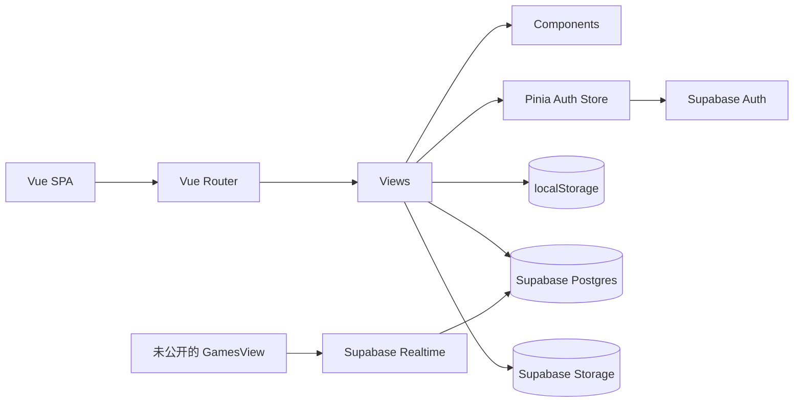
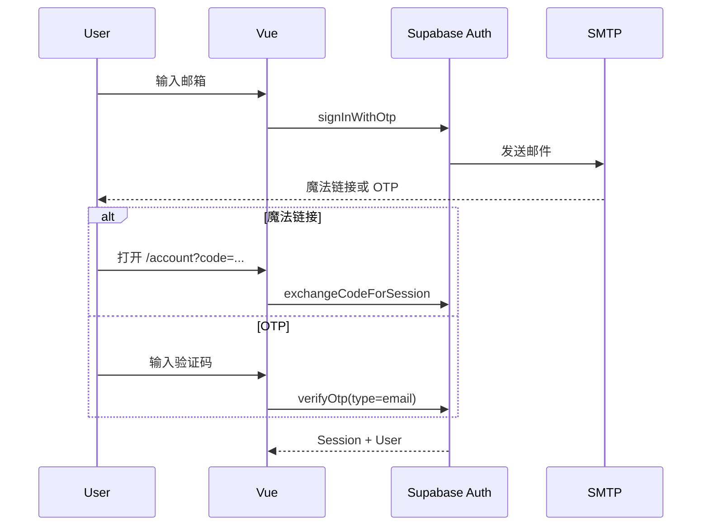
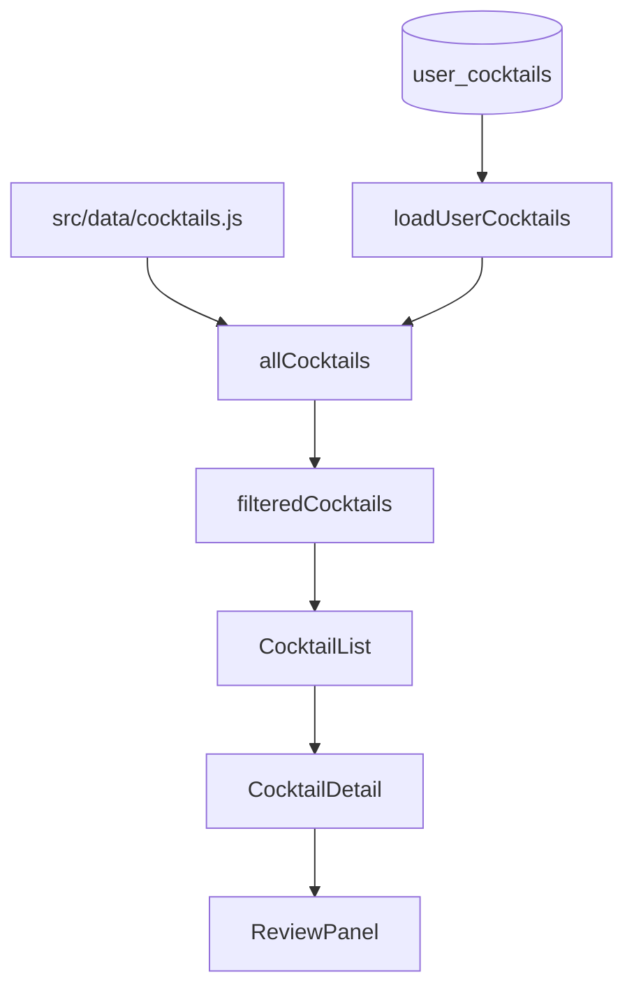

# Luceria Cocktail Atelier 技术文档

## 1. 技术栈

| 层级 | 技术 |
| --- | --- |
| UI | Vue 3.5、Composition API、单文件组件 |
| 构建 | Vite 6 |
| 路由 | Vue Router 4 |
| 状态 | Pinia 3 |
| 后端服务 | Supabase Auth、Postgres、Storage、Realtime |
| 样式 | 全局 CSS + 页面 scoped CSS |
| 部署 | Cloudflare Pages / Workers Assets |

主要依赖定义在 `package.json`，项目采用 ESM。

## 2. 系统架构



### 2.1 启动流程

入口：`src/main.js`

1. 创建 Vue App。
2. 注册 Pinia。
3. 注册 Router。
4. 调用 `auth.listenAuthChanges()`。
5. 调用 `auth.refreshSession()` 恢复已有会话。
6. 挂载 `App.vue`。

`App.vue` 提供 `RouterView` 和全局 `UserIdentityBadge`。

### 2.2 目录职责

| 目录 | 职责 |
| --- | --- |
| `src/views/` | 路由级页面和页面业务状态 |
| `src/components/` | 评论、列表、详情、登录弹窗和牌桌等组件 |
| `src/stores/` | Pinia 状态；当前核心是 Auth Store |
| `src/lib/` | Supabase 客户端初始化 |
| `src/data/` | 内置静态酒款 |
| `src/game/` | 与 Vue 解耦的牌局规则和机器人 |
| `src/styles/` | 全局设计系统和响应式样式 |
| `supabase/` | 表、索引、RLS、Storage 和 Realtime SQL |
| `scripts/` | 构建后处理和美术资源生成 |

## 3. 路由架构

路由定义：`src/router/index.js`

| Path | Name | View |
| --- | --- | --- |
| `/` | `home` | `HomeView.vue` |
| `/menu` | `menu` | `MenuView.vue` |
| `/cocktails` | `cocktails` | `CocktailsView.vue` |
| `/cocktails/new` | `cocktail-create` | `AddCocktailView.vue` |
| `/account` | `account` | `AccountView.vue` |
| `/stories` | `stories` | `StoriesView.vue` |
| `/games` | `games` | `DiceWheelView.vue` |
| `/tools` | `tools` | `ToolsView.vue` |

所有页面均使用动态 `import()` 懒加载。`scrollBehavior()` 在路由切换时返回页面顶部。

`GamesView.vue` 已实现联机牌局大厅，但当前 `/games` 指向 `DiceWheelView.vue`，因此联机牌局没有公开入口。

## 4. 状态管理

### 4.1 Pinia

`src/stores/auth.js` 管理：

- 当前 Supabase User。
- 登录和加载状态。
- 状态提示。
- `isLoggedIn` 和 `isAdmin`。
- 昵称、头像和资料修改冷却。
- 魔法链接、OTP、退出及 Access Token 刷新。
- 头像上传。

其他业务状态保留在各页面内，减少全局耦合。

### 4.2 localStorage

| Key | 用途 |
| --- | --- |
| `drink_auth_email_requested_at` | 登录邮件的客户端 60 秒冷却 |
| `drink_stories_forum_v2_fallback` | 论坛无 Supabase 时的本地数据 |
| `drink_stories_forum_actor_v1` | 论坛本地访客标识 |
| `drink_dice_history_v1` | 最近一次骰子结果 |
| `drink_wheel_options_v1` | 转盘选项 |
| `drink_wheel_history_v1` | 转盘历史 |

## 5. 认证与权限

### 5.1 Supabase 客户端

文件：`src/lib/supabase.js`

```text
autoRefreshToken: true
persistSession: true
detectSessionInUrl: true
flowType: pkce
```

客户端只允许使用 publishable/anon key。禁止在 Vite 环境变量中放置 `service_role`。

### 5.2 邮箱登录流程



关键函数：

- `sendMagicLink(rawEmail)`
- `verifyEmailCode(rawEmail, token)`
- `handleAuthRedirect()`
- `refreshSession()`
- `refreshAccessToken()`
- `listenAuthChanges()`

客户端会检查邮箱格式，并将重复发送间隔限制为 60 秒。生产环境仍需 Supabase 服务端 Rate Limit 和 CAPTCHA。

### 5.3 用户资料

资料存储在 `auth.users.user_metadata`：

- `display_name`
- `avatar_url`
- `profile_updated_at`

客户端限制每 7 天修改一次。这是产品级限制；若需要不可绕过的强约束，应在数据库或服务端实现。

### 5.4 管理员

管理员授权存储在 `raw_app_meta_data.role = 'admin'`，JWT 中对应：

```text
app_metadata.role
```

前端通过 `auth.isAdmin` 控制操作入口，真正的安全边界是 Postgres RLS。禁止使用用户可修改的 `user_metadata` 判断管理员。

管理员角色变化后必须刷新 Access Token 或重新登录。

## 6. 鸡尾酒模块

### 6.1 数据来源



用户酒款优先排列，再追加内置酒款。

`cocktailKey()` 使用：

- 用户酒款：`user:{uuid}`
- 静态酒款：`static:{name}`

### 6.2 创建酒款

文件：`src/views/AddCocktailView.vue`

流程：

1. 检查登录 Session。
2. 校验必填字段。
3. 校验材料为 2–12 行，每行 2–120 字符。
4. 校验图片 MIME 为 JPEG/PNG，大小不超过 5MB。
5. 上传到 `cocktail-images/{user_id}/{uuid}.{ext}`。
6. 获取公开 URL。
7. 插入 `user_cocktails`。
8. 插入失败时删除已上传文件。
9. 跳转 `/cocktails?created={id}`。

客户端拦截与内置酒款重复的英文名；数据库通过 `lower(name)` 唯一索引防止用户酒款之间重名。

### 6.3 评论

文件：`src/components/ReviewPanel.vue`

评论通过 `reviews.cocktail_name = cocktail.name` 关联，而不是外键。修改酒款英文名会造成历史评论无法匹配。

加载评论时先查询 `reviews`，再按评论 ID 批量查询 `review_likes`，在客户端合并点赞数量和当前用户状态。

## 7. 论坛模块

文件：`src/views/StoriesView.vue`

核心表：

- `stories_posts`
- `stories_replies`
- `stories_post_likes`
- `stories_post_favorites`
- `stories_reply_likes`

`stories_replies.parent_reply_id` 实现楼中楼。删除父回复会通过外键级联删除子回复。

页面负责：

- 分类和视图筛选。
- 最新/热度排序。
- 发帖和回复。
- 点赞和收藏。
- 作者/管理员删除。
- Supabase 不可用时 localStorage fallback。

## 8. 骰子与转盘

文件：`src/views/DiceWheelView.vue`

该模块不依赖 Supabase：

- 骰子数量范围为 1–20。
- 骰子结果以 1–6 点出现次数保存。
- 转盘通过 CSS `conic-gradient` 绘制。
- 旋转使用 CSS transform 和缓动。
- 转盘历史最多保存 100 条，界面显示有限高度并滚动。

所有数据都属于当前浏览器，清除站点数据后不可恢复。

## 9. 数据库模型

### 9.1 `reviews`

| 字段 | 说明 |
| --- | --- |
| `id` | UUID 主键 |
| `cocktail_name` | 酒款英文名 |
| `cocktail_zh_name` | 酒款中文名 |
| `rating` | 0–10 |
| `comment` | 最长 500 字 |
| `user_id` | `auth.users` 外键 |
| `user_email` | 发布快照 |
| `user_name` | 发布快照 |
| `user_avatar` | 发布快照 |
| `created_at` | 创建时间 |

### 9.2 `review_likes`

使用 `review_id` + `user_id` 表示用户对评论的点赞，并通过唯一约束防止重复。

### 9.3 `user_cocktails`

| 字段 | 约束 |
| --- | --- |
| `name` | 2–60，忽略大小写唯一 |
| `zh_name` | 1–40 |
| `category` | `classic/signature/nonalcoholic` |
| `base` | `whiskey/tequila/gin/rum/vodka/none` |
| `image` | 最长 500 |
| `naming` | 10–300 |
| `story` | 20–800 |
| `profile` | 5–200 |
| `method` | 2–80 |
| `ingredients` | `text[]`，2–12 项 |
| `user_id` | `auth.users` 外键 |
| `user_name` | 作者昵称快照 |

### 9.4 论坛

`stories_posts` 保存主题；`stories_replies` 保存回复。点赞和收藏采用关联表及组合主键。

### 9.5 游戏 Realtime

`games-realtime-setup.sql` 定义：

- `games_rooms`
- `games_room_members`
- `games_room_messages`

`games_rooms.game_state` 是 JSONB：

```json
{
  "lobbyBots": [],
  "ddz": {},
  "zjh": {}
}
```

三张游戏表加入 `supabase_realtime` publication。

## 10. RLS 权限矩阵

| 资源 | 读取 | 新增 | 修改 | 删除 |
| --- | --- | --- | --- | --- |
| `reviews` | 公开 | 本人 | 未开放 | 本人/管理员 |
| `review_likes` | 公开 | 本人 | 未开放 | 本人 |
| `user_cocktails` | 公开 | 本人 | 本人 | 本人/管理员 |
| `stories_posts` | 公开 | 本人 | 未开放 | 本人/管理员 |
| `stories_replies` | 公开 | 本人 | 未开放 | 本人/管理员 |
| 论坛点赞/收藏 | 公开 | 本人 | 未开放 | 本人 |
| `games_rooms` | 公开 | Host | Host；成员受限 | Host |
| `games_room_members` | 公开 | 本人 | 本人/Host | 本人 |
| `games_room_messages` | 公开 | 本人 | 未开放 | 未开放 |

RLS 中管理员使用：

```sql
(select auth.jwt() -> 'app_metadata' ->> 'role') = 'admin'
```

## 11. Storage

### 11.1 `avatars`

- Public bucket。
- 最大 3MB。
- MIME：PNG、JPEG、WEBP、GIF。
- 路径：`{user_id}/avatar.{ext}`。
- 用户只能写入、覆盖和删除自己的文件。

### 11.2 `cocktail-images`

- Public bucket。
- 最大 5MB。
- MIME：JPEG、PNG。
- 路径：`{user_id}/{uuid}.{ext}`。
- 登录用户可上传。
- Owner 或管理员可删除。
- 使用 `getPublicUrl()` 生成详情页图片地址。

## 12. 游戏引擎

虽然当前没有公开路由，项目保留完整牌局基础。

### 12.1 共享卡牌

`src/game/cards.js` 提供：

- 斗地主和炸金花牌组生成。
- Fisher-Yates 洗牌。
- 斗地主手牌排序。
- 牌 ID 解析和图片地址。

### 12.2 斗地主

| 文件 | 职责 |
| --- | --- |
| `doudizhu/patterns.js` | 牌型识别、比较、合法出牌搜索 |
| `doudizhu/engine.js` | 发牌、叫分、出牌、过牌、结算 |
| `doudizhu/bot.js` | Bot 叫分和出牌决策 |
| `DouDizhuTable.vue` | 牌桌 UI |

阶段：

```text
dealing → bidding → playing → settled
```

炸弹和火箭会提高倍数。

### 12.3 炸金花

| 文件 | 职责 |
| --- | --- |
| `zhajinhua/engine.js` | 发牌、看牌、跟注、加注、弃牌、比较和结算 |
| `zhajinhua/bot.js` | Bot 行为 |
| `ZhaJinHuaTable.vue` | 牌桌 UI |

牌型权重：

```text
单张 < 对子 < 顺子 < 金花 < 顺金 < 豹子
```

### 12.4 Bot 调度

`GamesView.vue` 使用延迟 Timer 和 1.5 秒 heartbeat 驱动 Bot。执行前重新读取最新房间状态，避免闭包中的过期状态造成机器人停滞。

## 13. 样式系统

全局样式：`src/styles/styles.css`

主要设计 Token：

- `--champagne`
- `--cream`
- `--paper`
- `--coffee`
- `--olive`
- `--gold-foil`
- `--ink`
- `--muted`
- `--line`
- `--shadow`

字体组合：

- 标题：Cormorant Garamond
- 中文：Noto Serif SC
- UI：Inter

响应式策略：

- `1120px`：主布局转为单列，酒款列表改为两列。
- `860px`：牌桌布局简化。
- `720px`：账号装饰和浮动身份控件调整。
- 页面 scoped 样式使用 `clamp()`、`900px/620px`、`940px/520px` 等局部断点。
- 支持 `prefers-reduced-motion`。

## 14. 构建与部署

### 开发

```powershell
npm install
npm run dev
```

### 验证

```powershell
npm run lint
npm run build
```

### Cloudflare

```text
Build command: npm run build
Output: dist
```

`wrangler.jsonc` 使用：

```text
not_found_handling: single-page-application
```

因此 `/cocktails/new` 等子路由可直接打开。

## 15. 测试策略

项目暂时没有自动化测试脚本。最低验证要求：

### Auth

- OTP 登录。
- 魔法链接 PKCE 回调。
- Session 刷新和退出。
- SMTP 失败、429 和过期 Token 提示。

### 鸡尾酒

- 静态和自定义酒款合并。
- 搜索和筛选。
- JPG/PNG 5MB 限制。
- 图片上传失败和数据库失败回滚。
- 重名约束。

### 评论和论坛

- 未登录拦截。
- 发布、点赞、收藏、删除。
- 管理员跨用户删除。
- RLS 直接 API 调用验证。

### 构建

- `npm run lint`
- `npm run build`
- Cloudflare SPA 深层路由。

### 联机牌局

接入路由前验证 Realtime、Host/Member 权限、断线恢复、Bot heartbeat 和恶意 `game_state` 修改。

## 16. 安全说明

### 已实现

- Exposed schema 表启用 RLS。
- 管理员权限使用 `app_metadata`。
- Storage 限制 MIME 和大小。
- PKCE 登录。
- 输入长度与枚举约束。
- 上传失败时清理孤立图片。

### 仍需关注

- 前端 anon/publishable key 是公开值，必须依靠 RLS，而不是依靠隐藏 Key。
- 登录邮件的客户端冷却可被绕过，必须配置 Supabase Rate Limit 和 CAPTCHA。
- Magic Link 可能被邮件安全扫描器提前消费，国内邮箱场景更适合 OTP。
- `games_rooms.game_state` 由客户端驱动，成员可能伪造状态；正式开放前应增加服务端规则校验。
- 游戏房间和消息当前可公开读取。
- 用户昵称和头像在内容中是发布时快照，修改资料不会更新历史内容。
- 公开 Storage 图片知道 URL 即可访问。
- 管理员身份初始化脚本应按部署环境修改，不应把通用管理员凭证写入前端。

## 17. 运维与故障排查

### 登录邮件发送失败

1. 检查 Supabase Auth Logs。
2. 检查 Resend Logs。
3. 确认 SMTP 凭据和域名为 Verified。
4. 检查邮件 Rate Limit。
5. 检查邮箱是否真实有效。

### 点击魔法链接仍未登录

- 检查 Auth Logs 是否出现 `One-time token not found`。
- 确认链接只使用一次。
- 检查 Site URL 和 Redirect URL。
- 确认打开链接的浏览器保留了 PKCE verifier。
- 对会预扫描链接的邮箱改用 `{{ .Token }}` OTP。

### 自定义酒款无法加载

- 检查 `user_cocktails` 是否存在。
- 检查 SELECT RLS。
- 检查 Supabase 环境变量。
- 查看浏览器网络请求和 Supabase API Logs。

### 图片上传失败

- 检查 bucket `cocktail-images`。
- 检查文件 MIME 和 5MB 限制。
- 检查 Storage INSERT policy。
- 确认用户已登录且 Token 未过期。

## 18. 后续建议

1. 增加 Vitest 单元测试和 Playwright E2E。
2. 评论改为通过 cocktail UUID 外键关联。
3. 增加用户酒款编辑和删除 UI。
4. 为投稿内容增加审核状态。
5. 配置 Turnstile CAPTCHA。
6. 将管理员初始化从硬编码 SQL 调整为安全运维流程。
7. 若公开联机牌局，将状态变更移至 Edge Function 或服务端权威逻辑。
8. 增加 CI，在 PR 中执行 lint、build 和测试。
